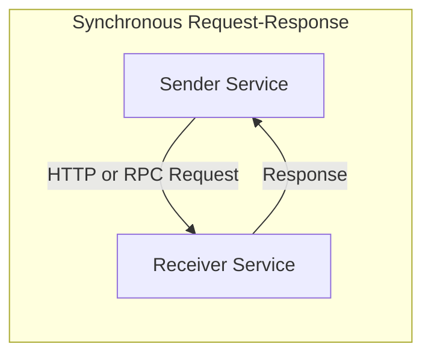
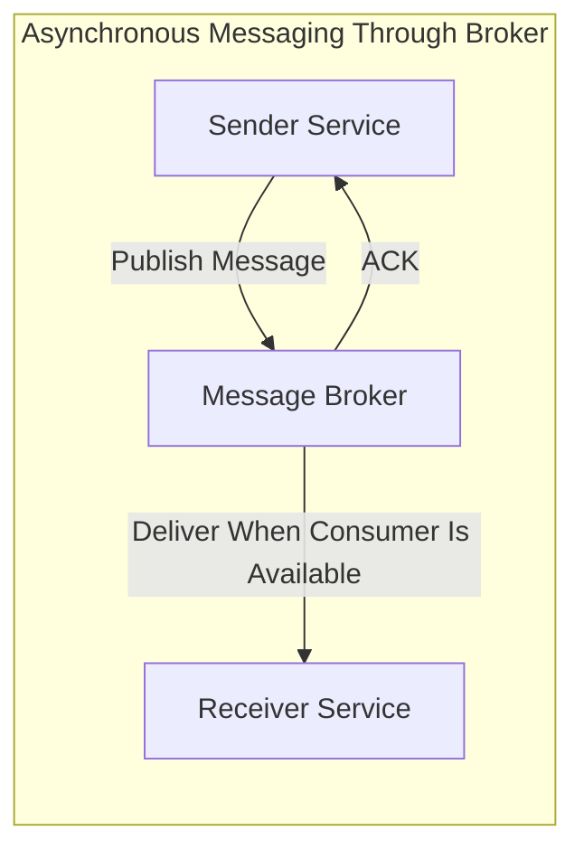
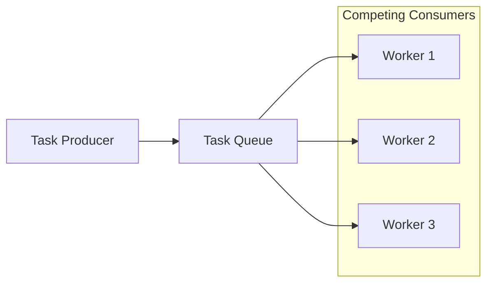
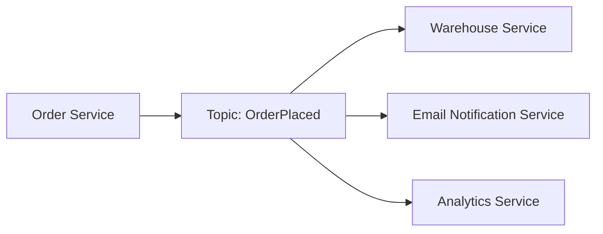
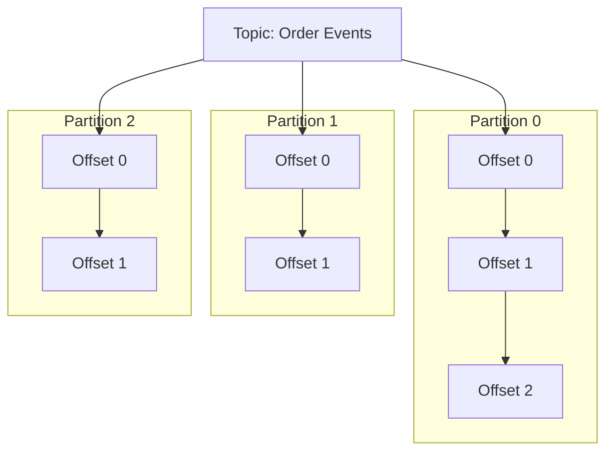
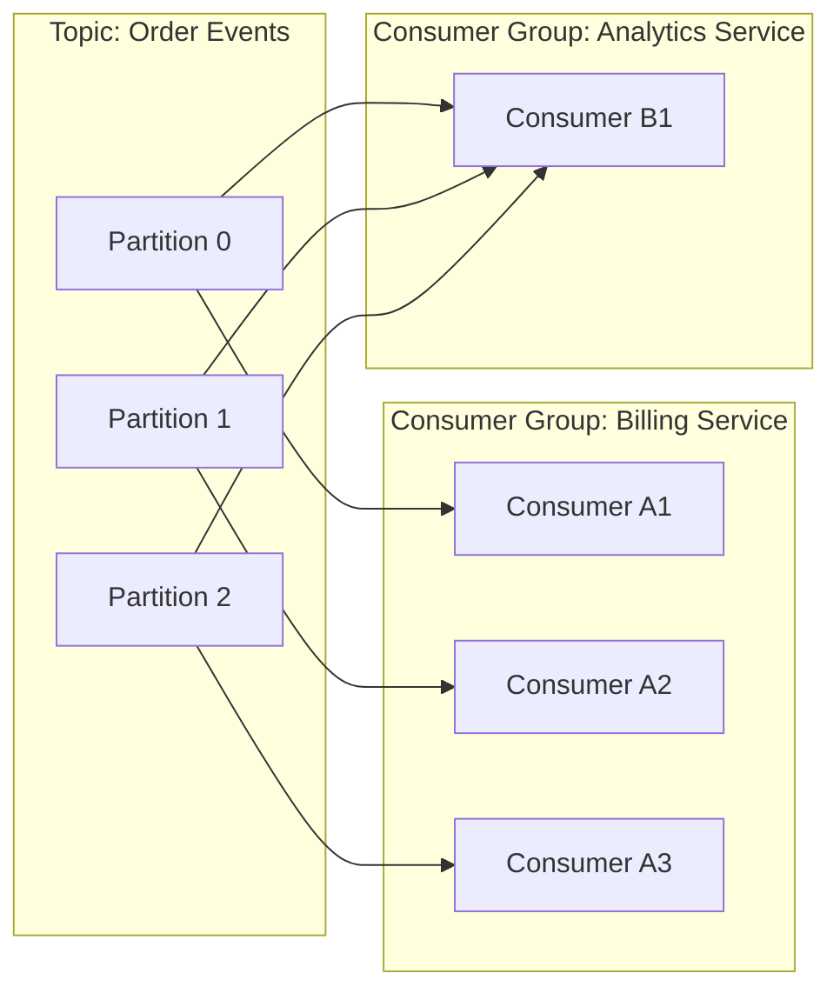

# Очереди сообщений и брокеры сообщений

## Краткое повторение

На прошлом занятии обсуждались распределённые транзакции, двухфазный коммит и Saga. Главная идея Saga состоит в том, что длинную бизнес-операцию лучше разбить на последовательность локальных шагов и, при необходимости, откатывать её не глобальным `rollback`, а компенсирующими действиями. В хореографической Saga сервисы координируются через события: один сервис публикует событие, другой на него реагирует, третий запускает свой шаг процесса.

Как только система начинает опираться на события, появляется практический вопрос: кто отвечает за их доставку? Что произойдёт, если сервис-получатель временно недоступен, перегружен или обрабатывает сообщения медленнее, чем они приходят? Именно здесь в архитектуре появляются очереди сообщений и брокеры сообщений.

**Брокер сообщений** — это промежуточный компонент, который принимает сообщения от отправителей, сохраняет их, маршрутизирует и доставляет получателям. Он меняет не только техническую реализацию обмена, но и сам стиль взаимодействия между сервисами: вместо немедленного вызова одного сервиса другим появляется асинхронная коммуникация.

## Зачем распределённой системе нужна асинхронная коммуникация

Синхронный вызов, например HTTP или RPC, удобен тогда, когда отправителю нужен немедленный ответ. Но в распределённой системе у такого подхода есть издержки. Отправитель должен дождаться получателя, сеть должна быть доступна прямо сейчас, а сам получатель не должен быть перегружен. Иначе задержка или отказ одного компонента немедленно отражается на другом. Это создаёт **временную связность**: оба сервиса обязаны быть доступны одновременно.

Очередь сообщений снимает эту жёсткую зависимость по времени. Отправитель публикует сообщение в брокер и может продолжить работу, не дожидаясь фактической обработки. Если получатель временно недоступен, сообщение не теряется сразу, а остаётся в брокере до тех пор, пока его не смогут обработать.

Такая модель даёт несколько важных эффектов. Во-первых, возникает **развязка по времени**: producer и consumer не обязаны работать одновременно. Во-вторых, брокер может играть роль буфера и сглаживать всплески нагрузки. Этот приём часто называют **load leveling**: входящий поток сообщений может быть резким, а обработка — более ровной и предсказуемой. В-третьих, появляется естественный способ горизонтального масштабирования: несколько экземпляров одного сервиса могут читать сообщения параллельно.

При этом важно понимать, что очередь не делает систему «проще автоматически». Она меняет набор проблем. Вместо прямых сетевых ошибок приходится думать о повторах доставки, порядке сообщений, накоплении очередей, задержках обработки и наблюдаемости асинхронных процессов. Поэтому брокер сообщений — это не только удобство, но и отдельная дисциплина проектирования.

### Базовые термины

Чтобы дальше не путаться в словах, полезно зафиксировать несколько базовых понятий.

- **Message** — единица данных, которую отправитель передаёт через брокер.
- **Producer/Publisher** — компонент, который публикует сообщение.
- **Consumer/Subscriber** — компонент, который получает и обрабатывает сообщение.
- **Broker** — система-посредник, принимающая, хранящая и доставляющая сообщения.
- **Queue** — структура, в которой сообщение обычно предназначено для одного обработчика.
- **Topic** — канал публикации, в который сообщение публикуется для нескольких независимых читателей.
- **Acknowledgment (ack)** — подтверждение того, что сообщение принято или обработано.

## Модели взаимодействия: point-to-point и publish-subscribe

В распределённых системах особенно часто встречаются две модели обмена сообщениями: **point-to-point** и **publish-subscribe**. Они решают разные задачи, и путать их не стоит.

### Point-to-point: очередь задач

В модели **point-to-point** сообщение помещается в очередь и затем обрабатывается одним из конкурирующих потребителей. Это типичная модель для фоновых задач: обработка изображений, отправка email, расчёт отчётов, выполнение долгих операций после пользовательского запроса. Идея здесь простая: работа должна быть сделана один раз, и неважно, какой именно worker её выполнит.

Такая схема хорошо масштабируется: если задач становится больше, можно поднять больше worker’ов. Она также хорошо подходит для **распределения нагрузки**, потому что очередь сама становится точкой балансировки. Но важно помнить о двух ограничениях. Первое: формулировка «каждое сообщение обрабатывается ровно одним потребителем» относится к логической модели. В реальной системе при сбое сообщение может быть выдано повторно другому worker’у, если первый не успел корректно подтвердить обработку. Второе: FIFO-порядок обработки при нескольких конкурирующих потребителях **не гарантирован**. Очередь выдаёт задачи в порядке поступления, но разные worker’ы завершат их в произвольном порядке. Если задачи связаны по состоянию, это нужно учитывать явно.

### Publish-subscribe: распространение событий

В модели **publish-subscribe** отправитель публикует событие в топик, а несколько независимых подписчиков получают его каждый для своей задачи. Здесь сообщение — это не «задание», а скорее «факт о том, что что-то произошло». Например, событие `OrderPlaced` может быть полезно и складу, и сервису уведомлений, и аналитике, и антифроду.

У publish-subscribe есть важное архитектурное преимущество: publisher не должен знать, кто именно читает событие и сколько вообще подписчиков существует. Это уменьшает связность между сервисами и делает систему более расширяемой. Новый подписчик может появиться позже, не меняя код отправителя.

Если сформулировать разницу коротко, то **queue чаще распределяет работу, а pub/sub распространяет факты**. Первая модель больше похожа на «нужно выполнить задачу», вторая — на «в системе произошло событие».

На практике современные брокеры часто поддерживают обе модели. Например, Kafka сочетает их: разные **consumer group** читают один и тот же топик независимо друг от друга, а внутри одной группы партиции распределяются между конкурирующими consumer’ами. Поэтому один и тот же брокер может одновременно работать и как механизм pub/sub, и как средство балансировки обработки.

## Гарантии доставки сообщений

Когда говорят о брокерах сообщений, почти сразу возникает вопрос: что именно система обещает по доставке? Здесь важно различать **доставку сообщения** и **бизнес-эффект от его обработки**. Брокер может гарантировать, что сообщение будет передано потребителю, но если consumer успел изменить внешнюю базу данных и упал до отправки `ack`, сообщение может прийти ещё раз. С точки зрения бизнеса это уже не просто «доставка», а повторное выполнение эффекта.

### At-most-once

Гарантия **at-most-once** означает: сообщение будет доставлено не более одного раза — то есть ровно одна попытка отправки без каких-либо повторов. Если при передаче возникнет ошибка, брокер или producer не будут пытаться доставить сообщение снова. Это полностью исключает дубликаты, но допускает потерю сообщения.

Такой режим оправдан там, где важна низкая стоимость обработки и допустима потеря отдельных событий: например, для неключевых логов, телеметрии, некоторых метрик. Идея проста: лучше потерять часть сообщений, чем случайно выполнить одно и то же действие дважды.

### At-least-once

Гарантия **at-least-once** означает: брокер будет пытаться доставить сообщение до тех пор, пока не получит явное подтверждение. Потеря становится гораздо менее вероятной, но появляется другая проблема — **дубликаты**. Классический сценарий выглядит так: consumer обработал сообщение, изменил состояние системы, но упал до отправки `ack`. Для брокера подтверждения нет, значит сообщение надо выдать повторно.

Это самая распространённая практическая гарантия, потому что она хорошо сочетается с отказоустойчивостью и относительно проста в реализации. Однако она требует, чтобы обработчик был **идемпотентным**.

### Exactly-once

Гарантия **exactly-once** звучит как идеальный вариант: сообщение должно дать эффект ровно один раз, даже если в системе были сбои, повторы и перезапуски. На практике это самая сложная семантика, потому что она требует координации между несколькими компонентами: producer, broker, consumer и иногда внешним хранилищем.

Важный нюанс состоит в том, что exactly-once почти никогда не является «магическим свойством всей системы». Обычно это строго определённая гарантия внутри конкретного конвейера обработки. Например, в Kafka её достигают с помощью **идемпотентного producer’а** и **транзакционной read-process-write обработки**, когда публикация выходных сообщений и фиксация прогресса чтения координируются как единое действие. Но если consumer дополнительно пишет во внешнюю БД или вызывает сторонний сервис, одной поддержки брокера уже недостаточно: там снова нужны идемпотентность, дедупликация или собственные транзакционные механизмы.

Именно поэтому в реальных системах часто выбирают не «чистое exactly-once любой ценой», а более практичную комбинацию: **at-least-once + идемпотентный consumer**.

### Сравнение гарантий доставки

| Гарантия | Возможна потеря сообщения | Возможны дубликаты | Типичный компромисс |
|---|---|---|---|
| At-most-once | Да | Нет | Ноль повторов: нет дубликатов, но возможна потеря |
| At-least-once | Существенно снижена | Да | Надёжнее доставка, но обработчик должен терпеть повторы |
| Exactly-once | В идеале нет | В идеале нет | Нужны транзакции, координация и более высокая сложность |

### Идемпотентность и дедупликация

**Идемпотентность** означает, что повторная обработка одного и того же сообщения не меняет итоговый результат по сравнению с однократной обработкой. Для асинхронных систем это одно из самых важных свойств. Если сообщение о списании денег может прийти дважды, обработчик обязан понять, что второе сообщение — это повтор, а не новая операция.

На практике для этого используют несколько типовых техник:

- уникальный **message ID** и хранение уже обработанных идентификаторов;
- **idempotency key** на уровне бизнес-операции;
- операции вида **upsert**, где повтор не создаёт новый эффект;
- дедупликацию в базе данных через уникальные ограничения.

Полезно запомнить простую мысль: **надёжность асинхронной системы очень часто обеспечивается не только брокером, но и дизайном потребителя**.

## Apache Kafka как пример современного брокера

Kafka удобно рассматривать как пример брокера, потому что она хорошо показывает современный «лог-ориентированный» подход к сообщениям. В классической очереди сообщение часто мысленно воспринимается как объект, который «забрали и удалили». В Kafka базовая модель иная: сообщение записывается в журнал, а потребители сами отслеживают, до какого места они дочитали.

### Topic, partition, offset

**Topic** в Kafka — это конкретная реализация общей абстракции «топика» из модели publish-subscribe: именованный поток сообщений, в который пишут producer'ы и из которого читают consumer'ы. Отличие от простого канала в том, что Kafka-топик внутри разбит на партиции, что делает его масштабируемым и отказоустойчивым.

Внутри топик разбивается на **partitions**, а каждая партиция представляет собой независимый упорядоченный append-only log. Сообщения внутри партиции имеют **offset** — порядковую позицию, которая монотонно возрастает.

Такое устройство даёт Kafka масштабируемость. Вместо одного общего потока сообщений система получает несколько независимых логов, которые можно хранить и читать параллельно. Но вместе с этим появляется важное ограничение: **порядок гарантирован только внутри одной партиции**. Глобального порядка по всему топику нет.

Отсюда следует практическое правило: если для некоторой сущности важен порядок событий, связанные сообщения должны попадать в одну и ту же партицию. Для этого producer часто использует **partition key** — например, `user_id` или `order_id`. Тогда все события одного пользователя или заказа будут упорядочены относительно друг друга.

### Producer, consumer и consumer group

**Producer** публикует запись в topic. Он может выбрать партицию явно, отправить сообщение по ключу или положиться на стандартное распределение. **Consumer** читает сообщения последовательно и хранит свой прогресс в виде offset. По сути offset — это закладка, показывающая, с какого места продолжать чтение после рестарта или сбоя.

Особенно важна концепция **consumer group**. Несколько потребителей могут объединяться в одну группу, и тогда партиции топика распределяются между ними. Внутри одной группы одна партиция в конкретный момент времени закрепляется только за одним consumer’ом. Это позволяет распараллеливать обработку без конкурирующего чтения одной и той же партиции внутри группы.

Эта схема показывает две важные идеи сразу. Первая: внутри **одной** группы партиции делятся между consumer’ами, то есть группа работает как competing consumers. Вторая: **разные** группы читают один и тот же топик независимо, то есть система одновременно поддерживает publish-subscribe между группами.

Из этого следует ещё одно практическое ограничение: максимальная степень параллелизма внутри группы ограничена числом партиций. Если в топике три партиции, то четвёртый consumer в той же группе не даст дополнительной пропускной способности и будет простаивать. Обратная ситуация тоже корректна: если consumer'ов меньше, чем партиций, один consumer может читать из нескольких партиций одновременно — как показывает Consumer B1 в диаграмме выше, который обслуживает все три партиции.

### Хранение, retention и replay

Kafka отличается от традиционной очереди тем, что факт чтения не означает немедленное удаление сообщения. Политика хранения называется **retention**, и в Kafka она бывает трёх видов. **Time-based** — записи хранятся заданное время (например, 7 дней), после чего удаляются. **Size-based** — партиция растёт до определённого объёма, затем старые сегменты вытесняются. **Log compaction** — Kafka оставляет только последнее сообщение для каждого ключа, удаляя устаревшие версии. Это особенно полезно для хранения текущего состояния сущностей: если несколько событий описывают разные версии одного и того же объекта, compaction оставит лишь актуальную.

Благодаря retention consumer может перечитать историю, то есть выполнить **replay**. Такая возможность полезна в нескольких сценариях: если в коде был баг и данные нужно обработать заново, если появляется новый сервис и ему надо восстановить картину прошлого, или если необходимо пересобрать материализованное представление состояния. В этом смысле Kafka — не просто транспорт, а долговечный журнал событий.

### Порядок и его границы

О порядке сообщений в Kafka важно говорить очень аккуратно. Часто говорят, что Kafka «гарантирует порядок», но это неполное утверждение. Корректно говорить так: **Kafka гарантирует порядок внутри одной партиции и только внутри неё**. Если связанные события распределились по разным партициям, их относительный порядок уже не определён.

Поэтому выбор числа партиций и ключа партиционирования — это архитектурный компромисс. Больше партиций означает выше потенциал параллелизма и масштабирования. Но если слишком агрессивно дробить поток, можно потерять важный локальный порядок обработки.

## Другие брокеры и их отличия от Kafka

Kafka — мощный инструмент, но далеко не единственный. Существуют брокеры с принципиально иной моделью, и выбор между ними зависит от требований конкретной системы.

### RabbitMQ

RabbitMQ — один из наиболее распространённых традиционных брокеров. В его основе лежит протокол **AMQP** и модель, построенная вокруг понятий **exchange** и **queue**. Producer публикует сообщение не напрямую в очередь, а в exchange — маршрутизатор, который по заданным правилам (routing key, headers, fanout) решает, в какую очередь отправить сообщение.

Ключевые отличия от Kafka.

- **Модель потребления** — RabbitMQ удаляет сообщение из очереди сразу после подтверждения (`ack`). Replay истории невозможен. Kafka хранит сообщения независимо от чтения.
- **Маршрутизация** — RabbitMQ поддерживает гибкую маршрутизацию на уровне брокера: одно сообщение может попасть в разные очереди в зависимости от правил exchange. В Kafka маршрутизация примитивна — producer выбирает топик и партицию.
- **Гарантии порядка** — RabbitMQ гарантирует порядок в рамках одной очереди, но только при одном consumer'е. Kafka гарантирует порядок в рамках партиции при любом числе consumer group.
- **Масштабирование** — Kafka масштабируется горизонтально через партиции и изначально проектировалась для высоких throughput. RabbitMQ масштабируется через кластеризацию и quorum queues, но исторически ориентирован на задержку, а не пропускную способность.

RabbitMQ хорошо подходит для сценариев с гибкой маршрутизацией, request-reply паттернами и задачами, где важна низкая задержка при небольших объёмах. Kafka — для потоков событий с высоким throughput, где нужен replay и долгосрочное хранение.

### Amazon SQS и облачные очереди

Amazon SQS — управляемый сервис очередей, который реализует модель point-to-point. Схожие сервисы есть у Google (Cloud Pub/Sub) и Azure (Service Bus).

Особенности SQS в сравнении с Kafka.

- **Нет партиций и consumer group** — SQS сам распределяет сообщения между потребителями, не давая контроля над параллелизмом.
- **At-least-once по умолчанию** — SQS может доставить сообщение более одного раза даже в стандартном режиме. Есть режим **FIFO** с гарантией однократной доставки, но с ограниченным throughput.
- **Нет replay** — SQS не хранит историю. Сообщение удаляется после обработки.
- **Visibility timeout** — вместо `ack`-модели SQS скрывает сообщение от других consumer'ов на заданное время. Если за это время не пришёл `DeleteMessage`, сообщение снова становится видимым.

Облачные очереди удобны своей простотой и отсутствием инфраструктурных забот. Но они не подходят для event sourcing, replay и сценариев, где требуется точный контроль над порядком и параллелизмом.

### Сравнение брокеров

| Характеристика | Kafka | RabbitMQ | Amazon SQS |
|---|---|---|---|
| Модель хранения | Лог (retention) | Удаление после ack | Удаление после обработки |
| Replay истории | Да | Нет | Нет |
| Маршрутизация | По топику и ключу | Гибкая (exchange) | Простая (одна очередь) |
| Порядок | Внутри партиции | Внутри одной очереди | FIFO-режим с ограничениями |
| Масштабирование | Партиции | Кластер / quorum queues | Автоматическое (managed) |
| Типичный сценарий | Event streaming, high throughput | Задачи, гибкая маршрутизация | Простые очереди задач в облаке |

### Как выбирать

Выбор брокера зависит от нескольких ключевых вопросов. Нужен ли replay событий? — тогда Kafka. Нужна ли гибкая маршрутизация или request-reply? — RabbitMQ. Нужна простота и управляемость в облаке без replay? — облачные очереди. Для большинства систем критичнее не сам брокер, а правильные гарантии доставки и идемпотентность consumer'а.

## Паттерны использования брокеров сообщений

### Outbox Pattern

Одна из самых частых проблем в микросервисах — так называемый **dual write problem**. Сервис должен одновременно изменить свою базу данных и опубликовать событие в брокер. Если сначала обновить БД, а затем отправить событие, процесс может упасть между этими действиями. Если сначала отправить событие, а потом не зафиксировать изменения в БД, другие сервисы увидят событие о том, чего на самом деле не произошло.

**Outbox Pattern** решает эту проблему так: сервис в рамках одной локальной транзакции записывает и бизнес-данные, и запись в специальную outbox-таблицу. Затем отдельный процесс читает outbox и публикует сообщения в брокер. Идея в том, что событие становится частью той же самой транзакции, что и изменение состояния.

Для реализации relay-процесса существуют два подхода. **Polling** — периодический опрос outbox-таблицы. Прост в реализации, но создаёт задержку и дополнительную нагрузку на базу данных. **Change Data Capture (CDC)** — чтение журнала изменений (WAL) базы данных напрямую, без опроса таблицы. Такие инструменты, как Debezium, умеют читать WAL PostgreSQL или MySQL и публиковать изменения в брокер с минимальной задержкой. CDC — более масштабируемый подход, но требует дополнительной инфраструктуры.

Для хореографической Saga это особенно полезно, потому что надёжная публикация событий становится частью бизнес-потока. Но даже outbox обычно не отменяет требования к идемпотентности потребителей: relay-процесс тоже может отправить сообщение повторно.

### Event Sourcing

В паттерне **Event Sourcing** состояние системы хранится не как «последняя версия записи», а как последовательность событий, которые к этому состоянию привели. Текущее состояние можно восстановить, воспроизведя события по порядку.

Эта идея хорошо сочетается с брокерами и лог-ориентированными системами, но важно не смешивать понятия. Kafka — это транспорт с настраиваемой политикой retention, а полноценный event store — это хранилище с гарантированной неизменяемой историей и доступом к любому событию по его идентификатору. Если в Kafka настроена политика `delete`, старые события будут удалены, и история окажется неполной. Kafka хорошо подходит в роли event store только при политике `compact` (хранение последней версии по ключу) или при достаточно долгом retention. Именно поэтому event-driven архитектуры, CQRS и event sourcing часто обсуждаются рядом с Kafka, но требуют осознанного выбора конфигурации.

### Dead Letter Queue

Иногда сообщение нельзя обработать даже после нескольких повторных попыток. Причина может быть в «ядовитом» сообщении, несовместимом формате, нарушении бизнес-ограничений или временно недоступной внешней зависимости. Если такие сообщения бесконечно возвращать в основной поток, можно получить цикл ошибок и остановить полезную обработку.

Для этого применяют **Dead Letter Queue (DLQ)** — отдельную очередь или топик, куда сообщение переносится после исчерпания лимита попыток. Это позволяет не потерять проблемные данные и одновременно не блокировать весь конвейер.

DLQ полезна только тогда, когда с ней действительно работают: анализируют причины ошибок, чинят обработчики, при необходимости переотправляют сообщения. Если DLQ есть «для галочки», она превращается в скрытое место, где накапливаются незамеченные инциденты.

## Итоги

Очереди сообщений и брокеры нужны не просто для удобной интеграции сервисов. Они меняют модель взаимодействия в распределённой системе. Вместо жёсткой синхронной зависимости появляется асинхронный обмен, в котором отправитель и получатель живут в разном темпе и могут переживать временные отказы друг друга.

Для проектирования полезно держать в голове несколько опорных идей.

- **Асинхронность уменьшает связность по времени**, но добавляет вопросы о повторах, задержках и наблюдаемости.
- **Point-to-point** подходит для распределения работы, а **publish-subscribe** — для распространения событий.
- На практике самой важной гарантией часто становится не exactly-once, а комбинация **at-least-once и идемпотентной обработки**.
- В Kafka ключевыми понятиями являются **topic, partition, offset и consumer group**.
- **Порядок в Kafka локален**: он надёжен внутри партиции, но не во всём топике сразу.
- Паттерны вроде **outbox**, **event sourcing** и **DLQ** помогают сделать асинхронную архитектуру управляемой и надёжной.

Если сформулировать главную мысль занятия в одной фразе, она будет такой: **брокер сообщений позволяет распределённой системе обмениваться данными не «здесь и сейчас», а «надёжно и в подходящем темпе»**. Именно это делает очереди и брокеры одним из базовых инструментов современной распределённой архитектуры.
